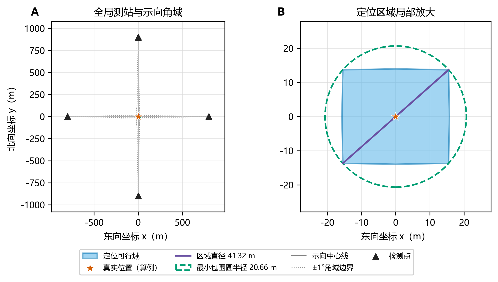
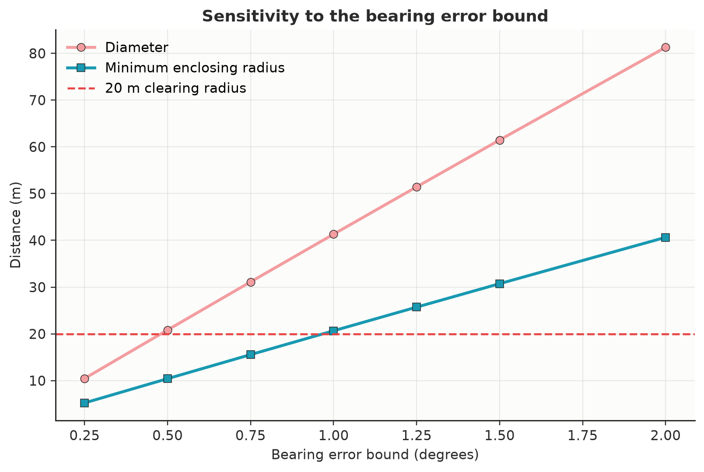

# 问题一 交会定位区域直径与覆盖圆判定

## 1 问题重述

设第 $i$ 个检测点为 $S_i=(x_i,y_i)$，测向机在该点测得同一干扰源的示向度为 $\hat\theta_i$。由于环境和仪器误差，真实方位角与示向度之差位于 $[-1^\circ,1^\circ]$。问题要求根据若干组 $(S_i,\hat\theta_i)$ 构造交会定位区域，计算区域内任意两点之间的最大距离，并判断以该距离为直径的圆能否覆盖整个定位区域。

该问题不是无误差射线求交，而是确定性有界误差下的集合定位问题。每次观测给出一个前向角域，多次观测的公共部分才是干扰源的位置可行域。

## 2 模型假设

1. 检测点坐标准确，坐标单位为米，方位角以正东方向为 $0^\circ$，逆时针为正方向。
2. 示向误差采用题目给定的确定性界 $\varepsilon=1^\circ$，不额外假设概率分布。
3. 同一地点的误差固定，因此同点重复观测不作为独立样本，也不通过平均缩小误差界。
4. 问题一首先计算由测向角域产生的纯交会区域。半径 1800 m 的目标圆盘作为可选物理先验；若精确加入该先验，区域边界可能包含圆弧，不再是严格多边形。
5. 输入观测可能产生空集、无界集、线段或单点，算法必须显式报告这些异常或退化情况。

## 3 符号说明

| 符号 | 含义 |
|---|---|
| $S_i$ | 第 $i$ 个检测点 |
| $\hat\theta_i$ | 第 $i$ 个检测点测得的示向度 |
| $\varepsilon$ | 示向误差上界，本题取 $1^\circ$ |
| $W_i$ | 第 $i$ 次观测对应的前向角域 |
| $K$ | 所有角域的交，即定位可行域 |
| $v_j$ | 定位多边形的第 $j$ 个顶点 |
| $D$ | 定位区域直径 |
| $R_*$ | 定位区域最小包围圆半径 |

## 4 有界角误差定位模型

### 4.1 单次观测的角域

定义方向单位向量

$$
u(\theta)=(\cos\theta,\sin\theta).
$$

第 $i$ 次观测的两条边界方向分别为

$$
u_i^-=u(\hat\theta_i-\varepsilon),\qquad
u_i^+=u(\hat\theta_i+\varepsilon).
$$

对候选源位置 $P=(x,y)$，记二维叉积为

$$
a\times b=a_xb_y-a_yb_x.
$$

因为误差角域的张角为 $2^\circ<180^\circ$，前向角域可以写成两个闭半平面的交：

$$
W_i=\left\{P:
u_i^-\times(P-S_i)\ge 0,
\quad
u_i^+\times(P-S_i)\le 0
\right\}.
$$

上述叉积符号同时限定了方向和左右边界，因而不会把边界射线的反向延长区域错误纳入可行域。角度先归一化到 $[0^\circ,360^\circ)$，但半平面由正弦和余弦直接生成，因此跨越 $0^\circ$ 的角域无需另行分段。本文算法要求 $0<\varepsilon<90^\circ$；题目给定的 $1^\circ$ 满足该条件。

### 4.2 多点交会定位区域

所有观测同时成立时，定位区域为

$$
K=\bigcap_{i=1}^{n}W_i.
$$

每个 $W_i$ 均为凸集，故 $K$ 仍为凸集。当交集非空且有界时，$K$ 为凸多边形。若使用目标圆盘先验

$$
\Omega=\{(x,y):x^2+y^2\le 1800^2\},
$$

则物理可行域为 $K_\Omega=K\cap\Omega$。为保持纯多边形计算，可以使用包含 $\Omega$ 的高精度外接正多边形作保守近似；不能使用内接多边形作保证性定位，否则可能排除真实位置。

### 4.3 半平面交求解

将所有不等式统一写成

$$
a_kx+b_ky\le c_k,\qquad k=1,\ldots,2n.
$$

本文程序采用以下稳健流程：

1. 对每个半平面的法向量归一化，统一几何容差的尺度；
2. 解零目标线性规划，判断约束组是否可行；
3. 分别优化 $x,-x,y,-y$，若任一方向无界，则报告定位区域无界；
4. 计算任意两条非平行边界直线的交点，保留满足全部半平面约束的点；
5. 对候选点去重并计算凸包，得到逆时针排列的顶点 $v_1,\ldots,v_m$。

该实现直接处理空集和无界情形，也能保留退化线段与单点。对本题的小规模观测集，边界两两求交并逐点验约束的最坏复杂度为 $O(n^3)$，但结构清晰、容易审查。若后续出现大量观测，可以替换为排序加双端队列的标准半平面交算法，将主体复杂度降为 $O(n\log n)$。

## 5 定位区域直径

定位区域直径定义为

$$
D=\max_{P,Q\in K}\|P-Q\|_2.
$$

连续函数在紧集上能取得最大值。又因为固定 $Q$ 时 $\|P-Q\|_2$ 是凸函数，其在凸多边形上的最大值可以在顶点取得；对 $Q$ 重复同样论证可知，最远点对必为一对顶点。因此

$$
D=\max_{1\le i<j\le m}\|v_i-v_j\|_2.
$$

程序枚举全部顶点对并保留所有达到最大值的点对，复杂度为 $O(m^2)$。由于本题中的 $m$ 通常很小，枚举法比旋转卡壳更简单且更易验证。若顶点规模显著增大，可改用旋转卡壳将该步骤降为 $O(m)$。

## 6 直径圆覆盖判定

### 6.1 直径圆并非必然覆盖

仅由定位区域直径为 $D$，不能推出半径为 $D/2$ 的圆一定覆盖该区域。考虑边长为 $D$ 的等边三角形，其直径仍为 $D$。以任意一条边为直径作圆，第三个顶点到圆心的距离为

$$
\frac{\sqrt3}{2}D>\frac D2,
$$

故第三个顶点位于圆外。这给出了题目第二问的否定性一般结论：直径圆不一定覆盖定位区域。

### 6.2 指定最远点对时的判据

设 $A,B$ 为一对最远顶点，$\|A-B\|_2=D$。以 $AB$ 为直径的圆为

$$
C=\frac{A+B}{2},\qquad r=\frac D2.
$$

该圆覆盖整个定位多边形，当且仅当

$$
\max_{1\le j\le m}\|v_j-C\|_2\le \frac D2.
$$

只需检查顶点：圆是凸集，若多边形全部顶点均在圆内，则顶点的任意凸组合也在圆内。若存在多组最远点对，程序逐组检查并分别报告结果。

### 6.3 圆心可自由选择时的判据

若题意理解为“寻找任意一个直径为 $D$ 的覆盖圆”，则需要计算最小包围圆：

$$
R_*=\min_C\max_{P\in K}\|P-C\|_2.
$$

由于 $K$ 中存在相距 $D$ 的点，任何覆盖圆均有 $R_*\ge D/2$。因此直径为 $D$ 的覆盖圆存在，当且仅当

$$
R_*=\frac D2.
$$

平面最小包围圆由一个点、作为直径端点的两个点或三个外接圆点支撑。程序枚举顶点的一元、二元和三元支撑集，选择能够覆盖全部顶点且半径最小的圆。对小规模定位多边形，该确定性算法便于复核；其最坏复杂度为 $O(m^4)$。

### 6.4 Jung 定理给出的普适界

上述现象可由平面 Jung 定理统一刻画。对任意直径为 $D$ 的非空紧集，其最小包围圆半径满足

$$
\frac D2\le R_*\le \frac{D}{\sqrt3}.
$$

下界由任意一对直径端点给出；上界是最坏情形的普适保证，并由边长为 $D$ 的等边三角形取到。因此，半径 $D/2$ 的“直径圆”一般不足以覆盖凸多边形；若不利用区域的具体形状，只知道直径 $D$，则保证覆盖所需圆的直径至多为

$$
2R_*\le \frac{2D}{\sqrt3}\approx1.1547D.
$$

该定理还给出一个无需计算最小包围圆的充分条件：若 $D\le20\sqrt3\approx34.641$ m，则必有 $R_*\le20$ m，可以保证一次清除成功；而 $D\le40$ m 不是充分条件。实际程序仍计算 $R_*$，因为 Jung 上界只利用直径信息，通常比针对具体定位区域的最小包围圆判定保守。

## 7 算法流程

```text
输入检测点与示向度
  -> 生成每次观测的两个前向半平面
  -> 线性规划判断可行性与有界性
  -> 求可行边界交点并构造凸包
  -> 枚举顶点对得到直径及全部最远点对
  -> 检查各最远点对对应的直径圆
  -> 计算最小包围圆并给出自由圆心判据
  -> 输出顶点、直径、圆心、半径和异常状态
```

## 8 算例与验证

为验证算法，构造真实干扰源位于原点、四个测站分别位于

$$
(-800,0),\ (800,0),\ (0,-900),\ (0,900)
$$

的对称算例，相应示向度依次为

$$
0^\circ,\ 180^\circ,\ 90^\circ,\ 270^\circ.
$$

在误差界 $\varepsilon=1^\circ$ 下，程序得到 8 个顶点的凸定位区域，直径为

$$
D=41.321338\ \text{m},
$$

最小包围圆圆心在数值误差范围内为原点，半径为

$$
R_*=20.660669\ \text{m}.
$$

该算例的直径圆能够覆盖定位区域，因为 $R_*=D/2$；但 $R_*>20$ m，因此仅凭这四次观测仍不能保证在最小包围圆圆心执行一次清除就成功。



程序还验证了以下边界情况：

- 单次观测产生无界角域；
- 互相矛盾的半平面产生空集；
- $359.5^\circ$ 附近观测能正确跨越 $0^\circ$；
- 前向角域排除测向射线的反向延长区域；
- 零误差输入被显式拒绝，避免两个重合半平面把射线误写成整条直线；
- 退化交集为线段或单点时仍能保留正确的顶点与直径；
- 等边三角形的任何直径圆均不能覆盖第三个顶点；
- 矩形的对角线直径圆能够覆盖全部顶点。
- 固定随机种子生成 50 组一致的四站观测，真实源均保留在各角域内，交集均被正确识别为有界区域，最小包围圆均覆盖全部定位顶点。

## 9 误差敏感性分析

保持上述测站位置不变，将示向误差界从 $0.25^\circ$ 增大到 $2^\circ$，结果如下。

| 误差界 | 定位区域直径 m | 最小包围圆半径 m | 能否保证 20 m 清除 |
|---:|---:|---:|:---:|
| 0.25° | 10.46 | 5.23 | 是 |
| 0.50° | 20.84 | 10.42 | 是 |
| 0.75° | 31.12 | 15.56 | 是 |
| 1.00° | 41.32 | 20.66 | 否 |
| 1.25° | 51.44 | 25.72 | 否 |
| 1.50° | 61.47 | 30.73 | 否 |
| 2.00° | 81.28 | 40.64 | 否 |



结果表明，在该测站构型下，定位直径和最小包围圆半径随角度误差近似线性增加。题目规定的 $1^\circ$ 误差恰使最小包围圆半径略高于 20 m，说明后续在线策略不应只检查点估计，而应继续增加异地观测，直到整个可行域满足保证性清除条件。

## 10 结论及对后续问题的作用

问题一可以归结为有界角误差下的凸可行域构造、凸多边形直径计算和最小包围圆判定。每次示向观测应建模为前向角域而非精确射线；多次角域的半平面交给出所有可能源位置。定位区域直径由顶点最远点对取得，但直径为 $D$ 的圆不一定覆盖任意直径为 $D$ 的定位区域，具体区域必须检查直径圆或计算最小包围圆。

对问题三、四，可靠的清除条件应为

$$
R_*(K)\le20\ \text{m},
$$

而不能简单替换成 $D(K)\le40$ m。满足该条件后，以最小包围圆圆心作为清除点，才能保证真实干扰源与清除点的距离不超过 20 m。

## 11 参考文献

[1] Jung H. Über die kleinste Kugel, die eine räumliche Figur einschließt[J]. Journal für die reine und angewandte Mathematik, 1901, 123: 241-257.

## 12 复现说明

在仓库根目录安装依赖并运行：

```bash
python -m pip install -r requirements.txt
python -m unittest discover -s tests -v
python src/question1_demo.py
```

核心实现位于 `src/question1_geometry.py`，单元测试位于 `tests/test_question1_geometry.py`。算例完整数值输出保存在 `results/tables/question1_demo.json`，两幅图由 `src/question1_demo.py` 直接生成；每幅图同时输出 PNG、PDF、SVG 和灰度 PNG，便于论文排版与黑白打印检查。论文中的算例数字与保存结果一致。
