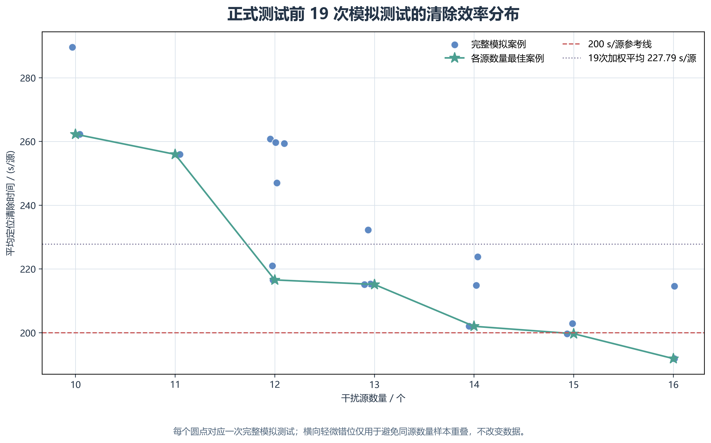
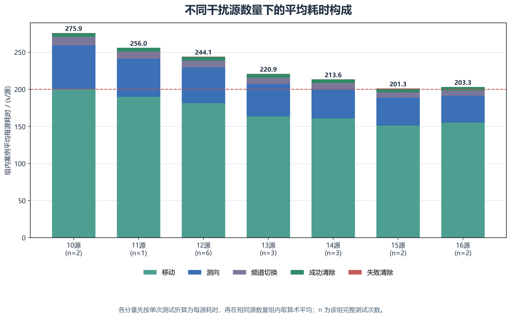
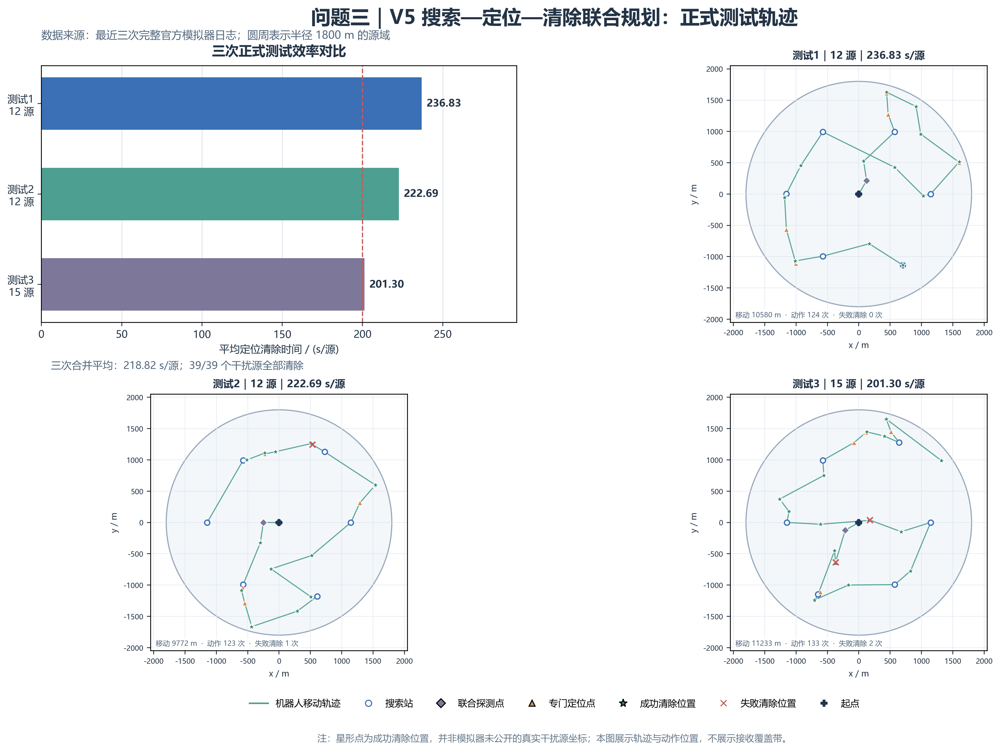
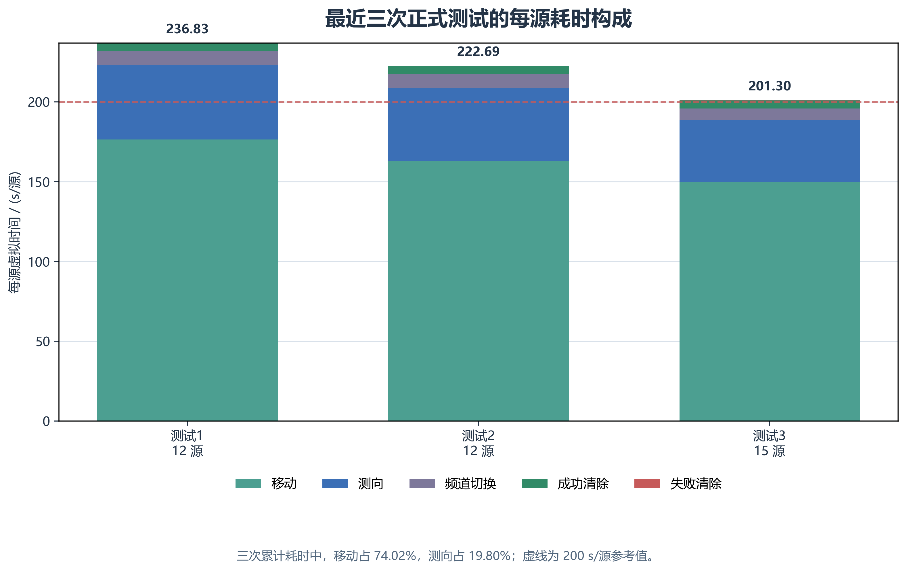

# 问题三 全向多干扰源的搜索—定位—清除联合规划

## 1 问题重述

目标区域为半径 1800 m 的圆域，其中分布着 10—16 个全向干扰源。各干扰源占用互不相同的频道，其具体数量、频道、位置及有效接收半径均未知；有效接收半径位于 1000—1500 m。机器狗从原点出发，测向机初始位于频道 1，需要仅依据逐次测向与清除反馈，自动发现、定位并清除全部干扰源，同时尽量缩短完成任务所需的虚拟时间。

本问不是目标坐标已知时的普通路径规划问题，而是部分信息条件下的在线搜索—定位—清除联合决策问题。算法既要为尚未发现的频道建立全区域搜索保证，又要对已发现频道持续压缩位置可行域，还要在搜索站、定位点和清除点之间安排短路径。因此，本文采用滚动规划策略：每条接口反馈均立即写入频道状态与几何可行域；每轮只承诺执行当前计划的首个任务单元，待该单元包含的同点扫描、共享测向或清除动作完成后再重新规划。

## 2 模型假设与计算口径

1. 目标区域为闭圆盘

   $$
   \Omega=\left\{x\in\mathbb R^2:\lVert x\rVert_2\le 1800\right\},
   $$

   坐标和距离单位均为米，机器狗在相邻动作位置间作直线移动。

2. 第三问中的干扰源均为全向源；频道集合为 $\{1,2,\ldots,20\}$，每个频道至多对应一个未清除干扰源，源总数属于 $\{10,11,\ldots,16\}$。

3. 示向度的物理误差不超过 $1^\circ$，接口将角度保留至 $0.01^\circ$。为同时覆盖测量误差与舍入误差，程序采用保守半角

   $$
   \varepsilon=1^\circ+0.005^\circ=1.005^\circ.
   $$

   同一位置的误差固定，因此同点重复测向不作为独立信息，也不通过平均缩小误差界。

4. 对尚未清除的全向源，检测点到源的距离不超过 1000 m 时必能接收信号；收到一般方向反馈时，源距检测点不超过 1500 m；收到 `near` 时，源距检测点不超过 5 m。清除作用半径为 20 m。

5. 算法只能使用机器狗当前位置、测向机频道、已有动作记录以及 `direction`、`near`、`no_signal` 和清除反馈，不读取仿真器内部的真实源数量、坐标或接收半径。

6. 几何计算始终保留真实源可能出现的全部位置。圆域离散和非凸区域处理均取保守外近似；这可能推迟清除或增加测向，但不会因数值近似而错误给出保证清除结论。

## 3 符号说明

| 符号 | 含义 |
|---|---|
| $\Omega$ | 半径 1800 m 的目标圆域 |
| $c$ | 频道编号，$c\in\{1,\ldots,20\}$ |
| $K_c$ | 频道 $c$ 对应干扰源的保守位置可行域 |
| $\mathcal P_c,\mathcal N_c$ | 频道 $c$ 的有信号、无信号检测点集合 |
| $O_c,R_c$ | $K_c$ 的最小包围圆圆心与半径 |
| $V_c$ | 凸多边形 $K_c$ 的顶点集合 |
| $A_{q,r,s}$ | 第 $q$ 个扇区在半径 $r$、边界侧 $s$ 上的角点 |
| $\mathcal S_q$ | 第 $q$ 个扇区的搜索站可行域 |
| $p_t$ | 第 $t$ 次决策时机器狗的位置 |
| $L$ | 全部动作形成的累计移动距离，单位为 m |
| $N_M,N_S$ | 测向次数与频道切换次数 |
| $N_C^+,N_C^-$ | 成功清除次数与失败清除次数 |
| $N_{\mathrm{src}},\eta$ | 案例中的真实源数与被清除源比例 |
| $T,\bar T$ | 总虚拟时间与单位干扰源平均定位—清除时间 |

## 4 时间目标与在线状态

按题设计时规则，总虚拟时间为

$$
T=\frac{L}{5}+5N_M+N_S+5N_C^++3N_C^-.
$$

其中，频道切换只在相邻两次合法测向的频道发生变化时计数，清除动作不改变测向机当前频道。

若最终成功清除 $N_C^+$ 个源，则评价指标为

$$
\bar T=\frac{T}{N_C^+}.
$$

被清除源比例为

$$
\eta=\frac{N_C^+}{N_{\mathrm{src}}}.
$$

完整清除即 $\eta=100\%$，且优先于时间优化；只有在全部干扰源均被清除的前提下，$T$ 或 $\bar T$ 的减小才有意义。

算法对每个频道维护“未确认、已发现、已清除、已判空”四类状态。对已发现频道 $c$，进一步记录

$$
X_c=\left(K_c,O_c,R_c,\mathcal P_c,\mathcal N_c,
n_c^{\mathrm{loc}},n_c^{\mathrm{trial}}\right),
$$

分别表示保守可行域、路线代表点、不确定半径、正负观测集合、专门定位次数和试探清除失败次数。这里必须区分两个用途：$O_c$ 是路线规划使用的代表点，而能否保证清除由整个 $K_c$ 决定，不能以点估计代替集合证据。

当前路线模块直接最小化任务代表点之间的估计移动距离，测向、切换和清除成本则由共享观测、触发阈值与动作规则间接控制。因此，该方法是以完整清除为约束、面向总耗时的复合启发式，不构成对 $T$ 的全局最优性证明。

## 5 六扇区连续覆盖搜索

### 5.1 扇区划分与搜索站可行域

机器狗首先在原点扫描全部 20 个频道。该动作能够覆盖半径 1000 m 的中心圆域。对外侧区域，算法以方向

$$
\phi_q=(q-1)\frac{\pi}{3},\qquad q=1,\ldots,6,
$$

将其划分为六个 $60^\circ$ 扇区。第 $q$ 个扇区在半径 $r\in\{990,1800\}$ 和两条角边界 $s\in\{-1,1\}$ 上的四个角点为

$$
A_{q,r,s}=r\begin{bmatrix}
\cos(\phi_q+s\pi/6)\\
\sin(\phi_q+s\pi/6)
\end{bmatrix}.
$$

搜索站不固定为单一坐标，而从四个半径 990 m 圆盘的交集中选择：

$$
\mathcal S_q=
\bigcap_{r\in\{990,1800\}}
\bigcap_{s\in\{-1,1\}}
\left\{S:\lVert S-A_{q,r,s}\rVert_2\le 990\right\}.
$$

990 m 相对最小接收半径 1000 m 留出 10 m 余量。四角约束为搜索站提供局部覆盖构造，中心圆域与六个扇区共同形成全域搜索框架。程序不直接凭“四角已覆盖”判定频道为空，而是在实际访问点上继续执行第 5.3 节的连续覆盖复核，从而使最终判空不依赖离散网格或单一示意构型。

### 5.2 可移动搜索站优化

当至少存在一个已发现源时，算法先在每个扇区的径向参考点

$$
D_q=1500
\begin{bmatrix}
\cos\phi_q\\
\sin\phi_q
\end{bmatrix}
$$

上作可行投影，得到初始搜索站 $S_q^{(0)}=\Pi_{\mathcal S_q}(D_q)$，并据此完成第一次联合排路。设所得次序中某个非末端搜索站的前、后任务代表点分别为 $P,Q$，则站点位置近似求解

$$
\min_{S\in\mathcal S_q}
\left(\lVert P-S\rVert_2+\lVert S-Q\rVert_2\right).
$$

实现时，先将 $P$ 投影到四圆盘交集得到可行初值，再用 SLSQP 在四个圆盘约束下优化两段距离和；迭代上限为 30，函数容差为 $10^{-7}$。数值结果再次投影回 $\mathcal S_q$，且仅在优于初值时接受。若该搜索站位于开放路线末端，则不存在返回段，程序直接取 $\Pi_{\mathcal S_q}(P)$，只缩短进入该站的距离。采用版只进行一轮站点位置调整，再按新坐标重排开放路线。这样既保留连续覆盖条件，又允许搜索站顺应相邻任务位置，减少固定站点造成的绕行。

### 5.3 空频道的连续覆盖判据

若频道 $c$ 尚未收到任何信号，单个 `no_signal` 只能说明该点附近没有该频道源，不能直接判定频道为空。记该频道全部无信号检测点为 $\mathcal N_c$，定义这些检测点对目标圆域的覆盖半径

$$
\rho_c=\max_{x\in\Omega}\min_{N\in\mathcal N_c}\lVert x-N\rVert_2.
$$

当数值程序验证

$$
\rho_c\le 1000\ \mathrm{m}
$$

时，若频道 $c$ 存在未清除全向源，该源必应在至少一个检测点产生信号；与全部无信号事实矛盾，因此可将频道判空。程序通过枚举目标圆域内部的 Voronoi 顶点、站点垂直平分线与目标圆边界的交点以及边界驻点计算上述最大最近站距离，而不是用有限网格抽样代替连续覆盖证明。

对于始终未被发现的频道，算法会在原点及全部必要扇区搜索站执行测量，直至通过该判据排除。若已经成功清除 16 个不同频道，则可利用源总数上界直接结束；相反，清除 10 个源不能作为停止条件，因为 10 只是源数下限。

## 6 基于反馈的保守集合定位

### 6.1 正方向反馈的角域约束

定义方向单位向量 $u(\theta)=(\cos\theta,\sin\theta)$，二维叉积为 $a\times b=a_xb_y-a_yb_x$。检测点 $S$ 返回示向度 $\hat\theta$ 后，与误差相容的前向角域为

$$
W(S,\hat\theta,\varepsilon)=
\left\{G:
u(\hat\theta-\varepsilon)\times(G-S)\ge0,\quad
u(\hat\theta+\varepsilon)\times(G-S)\le0
\right\}.
$$

频道首次返回一般方向反馈时，初始可行域取为

$$
K_c=\Omega^{\mathrm{out}}
\cap W(S,\hat\theta,\varepsilon)
\cap B^{\mathrm{out}}(S,1500)
\cap H_{\neg\mathrm{near}},
$$

其中 $\Omega^{\mathrm{out}}$ 和 $B^{\mathrm{out}}$ 分别为相应圆域的 72 边外接正多边形，

$$
H_{\neg\mathrm{near}}=
\left\{G:u(\hat\theta)^{\mathsf T}(G-S)
\ge5\cos\varepsilon\right\}
$$

是“一般方向反馈而非 `near`”给出的保守线性约束。外接离散只会扩大圆域，不会排除与真实反馈相容的位置。后续方向反馈继续用新的 $W(S,\hat\theta,\varepsilon)$ 裁剪原多边形；采用版未对每个后续正反馈重复加入 1500 m 圆约束，以保持既定的保守实现口径。

若返回 `near`，则直接令 $O_c=S,R_c=5$ m。由于 $5<20$，该点随后可以进入保证清除分支。

### 6.2 无信号反馈的区域收缩

对已经发现的频道，`no_signal` 含有两类确定性信息。第一，由该源接收半径至少为 1000 m，有

$$
G\notin B(N,1000),\qquad N\in\mathcal N_c.
$$

第二，若 $P\in\mathcal P_c$ 曾收到该频道信号，而 $N\in\mathcal N_c$ 未收到信号，则同一未知接收半径给出

$$
\lVert G-P\rVert_2\le \lVert G-N\rVert_2,
$$

等价地，

$$
(N-P)^{\mathsf T}G
\le\frac12(N-P)^{\mathsf T}(N+P).
$$

程序先用所有正负检测点对生成的垂直平分线半平面裁剪 $K_c$，再排除各无信号点的 1000 m 开圆盘。由于“凸多边形减圆盘”可能成为非凸集，采用版保存其凸包作为外近似：

$$
K_c\leftarrow
\operatorname{conv}\!\left(K_c\setminus B^\circ(N,1000)\right).
$$

该处理可能重新纳入部分已被排除的位置，但不会删除真实源位置，因而只影响收缩速度，不破坏最终保证。

### 6.3 最小包围圆与不确定度

每次更新后，计算可行多边形顶点的最小包围圆

$$
R_c=\min_O\max_{v\in V_c}\lVert v-O\rVert_2,
\qquad
O_c\in\arg\min_O\max_{v\in V_c}\lVert v-O\rVert_2.
$$

由于 $K_c=\operatorname{conv}(V_c)$，覆盖全部顶点即覆盖整个可行域。程序用至多三个支撑点确定最小包围圆，并将最终半径扩展到实际最远顶点距离，以避免浮点误差产生不安全的 20 m 清除证书。$O_c$ 同时作为路线任务的代表点，$R_c$ 则统一衡量当前定位不确定度。

## 7 搜索任务与源任务的联合调度

### 7.1 开放路线构造

若当前尚无已发现源，程序不调用联合排路，而是把当前位置分别投影到各未完成扇区的 $\mathcal S_q$，选择投影距离最近的扇区作为下一站。至少发现一个源后，决策时刻 $t$ 的任务集合才由所有已发现但未清除源的代表点 $O_c$ 与未完成扇区的可行搜索站共同组成。若任务访问顺序为 $\pi$，相应任务坐标为 $X_{\pi_j}$，路线代理目标为

$$
J_t=
\lVert p_t-X_{\pi_1}\rVert_2+
\sum_{j=1}^{m-1}\lVert X_{\pi_j}-X_{\pi_{j+1}}\rVert_2,
$$

且路线不要求返回起点。算法依次强制每个任务作为首点，用最近邻规则构造完整开放路线；按初始长度保留最短的四条候选，再对每条路线至多执行 $2m$ 轮开放路径 2-opt。每轮接受当前缩短量最大的片段反转，没有改进时提前结束，最后返回四条候选中的最短路线。

存在已发现源时，源任务与搜索任务在同一路线中排序，避免“先完成全部搜索”或“发现一个立即追踪到底”造成的固定阶段割裂。算法每轮仅执行当前路线的第一项任务；真实反馈改变 $K_c$、$O_c$、$R_c$ 或待搜索扇区后，下一轮立即重新规划。因此，代表点误差不会被固化到整条后续路线中。

### 7.2 原点后的共享探测

原点扫描若发现至少一个仍需定位的源，算法在半径 250 m 圆周上的 12 个等角候选点

$$
\mathcal Q_{250}=
\left\{250u(k\pi/6):k=0,1,\ldots,11\right\}
$$

中选择一次共享探测位置。对候选点 $q$，以当前圆心方向模拟一次角域裁剪，记频道 $c$ 的预测新半径为 $\widehat R_c(q)$，则选择

$$
q^*=\arg\max_{q\in\mathcal Q_{250}}
\sum_{c:R_c>20}\left(R_c-\widehat R_c(q)\right).
$$

随后在 $q^*$ 对所有 $R_c>20$ m 的已发现频道各执行一次真实测向。候选评估只使用当前可行域，真正更新仍以接口返回值为准。采用版只执行一轮该探测，且不在该位置扫描尚未发现的频道。

### 7.3 搜索与清除后的顺路共享测向

完成原点或扇区搜索，或一次保证/试探清除正常返回后，算法检查当前位置能否顺便缩小其他已发现源的可行域；允许的试探失败也属于正常返回。专门定位动作后不立即触发这项检查。频道 $c$ 需同时满足：

- $R_c>(20-10^{-6})$ m；
- 当前点距该频道最近一次有效测向点不少于 150 m；
- 当前点距 $O_c$ 不超过 1500 m；
- 依据当前圆心方向预测裁剪后，最小包围圆半径小于 $0.7R_c$。

只有四项同时满足才执行真实共享测向。该规则以“可获得足够新的交会几何”为门槛，在不增加移动的前提下交换少量测向与切换时间，旨在减少后续专门定位行程。

### 7.4 专门定位点的选择

当某源仍需专门定位时，以 $K_c$ 的最小包围圆圆心为基本目标。为避免测向位置反复落在不利几何方向，当该源已完成的专门定位次数为偶数时，采用版寻找 $V_c$ 中的最远顶点对；计数初值为 0，故偏置对应第 1、3、5 等奇数序号的专门定位动作。以最长弦方向构造单位向量 $u$，并令垂直单位向量为 $v$，两个偏置候选点为

$$
p_\pm=O_c+0.25R_cu\pm0.10R_cv.
$$

算法调整 $u$ 的朝向使候选总体靠近机器狗一侧，只保留满足

$$
\max_{x\in V_c}\lVert x-p_\pm\rVert_2<1000\ \mathrm{m}
$$

的点，以保证在最小接收半径下仍能收到该源信号；若两个候选均可行，则选择离当前位置较近者，否则访问 $O_c$。

## 8 保证清除、试探清除与继续定位

### 8.1 保证清除

当

$$
R_c\le(20-10^{-6})\ \mathrm{m}
$$

时，半径 20 m 的清除圆存在。为减少移动，程序并不固定前往 $O_c$，而是在

$$
\mathcal C_c=
\bigcap_{v\in V_c}B\!\left(v,20-10^{-6}\right)
$$

中选择离当前位置最近的清除点

$$
q_c^*=\arg\min_{q\in\mathcal C_c}\lVert q-p_t\rVert_2.
$$

因为距离函数在凸多边形上的最大值可由顶点取得，$q_c^*$ 到全部顶点不超过清除半径即可保证覆盖整个 $K_c$。若频道处于 `near` 状态，则直接在对应检测点清除。保证清除若失败，程序将其视为几何不变量被破坏并立即报错，而不把它当作普通决策分支。

### 8.2 试探清除

当 $(20-10^{-6})<R_c\le40$ m 且该频道试探次数少于 12 时，算法利用“失败清除只消耗 3 s 且能产生排除信息”的规则进行试探。先取离当前位置最近的顶点

$$
v^*=\arg\min_{v\in V_c}\lVert p_t-v\rVert_2,
$$

再向圆心内移至多 18 m：

$$
q_c^{\mathrm{trial}}=v^*+
\min\left\{1,\frac{18}{\lVert O_c-v^*\rVert_2}\right\}(O_c-v^*).
$$

试探成功即完成该频道；若返回 `no_target_in_range`，则真实源必在清除圆外，程序更新

$$
K_c\leftarrow
\operatorname{conv}\!\left(
K_c\setminus B^\circ(q_c^{\mathrm{trial}},20-10^{-5})
\right),
$$

并重算最小包围圆。试探清除是降低平均耗时的启发式分支，不具有单次成功保证；失败反馈形成的排除约束保证算法仍回到保守定位流程。

### 8.3 继续定位及运行护栏

若 $R_c>40$ m，或试探失败次数已达到上限，则执行第 7.4 节的专门定位动作。实现还设置以下自检护栏：主循环动作记录达到 550 时终止并报错；专门定位前若可行域半径接近或超过 1000 m，则拒绝可能失去接收保证的动作；保证清除失败、负反馈更新后区域为空或最终清除数不在 10—16 时均显式报错。定位计数在测量后递增，并在大于 12 时触发异常，因此当前代码实际在第 13 次专门定位后执行该护栏检查。

## 9 完整算法流程与复杂度

```text
输入：机器狗动作接口、初始位置 (0,0)、初始频道 1
输出：清除频道与清除点、各频道观测和后验区域、路线决策、单位源平均虚拟耗时

1. 初始化 20 个频道状态、六个待搜索扇区及观测记录。
2. 在原点扫描全部未知频道；按反馈建立可行域或记录无信号点。
3. 若原点已发现待定位源，从半径 250 m 的 12 个候选点中选择一次共享探测点，
   对所有半径大于 20 m 的已发现频道测向。
4. 当仍有未完成频道时循环：
   4.1 检查动作护栏；若已清除 16 个源，则利用数量上界停止。
   4.2 若某源满足 $R_c\le20-10^{-6}$ m 且 $\lVert p_t-O_c\rVert_2\le40$ m，优先执行保证清除，并在清除正常返回后检查共享测向。
   4.3 若尚无已发现源，选择当前位置到各扇区可行域投影中最近的一站；否则生成已发现源任务和剩余扇区搜索任务，构造开放路线并调整可移动搜索站。
   4.4 只执行本轮选定的首任务：
       - 搜索任务：到站扫描未知频道，并尝试对已发现频道共享测向；
       - 源任务：按 R_c 选择保证清除、试探清除或专门定位；前两者正常返回后检查共享测向。
   4.5 用真实反馈更新正负观测、可行域、最小包围圆和频道状态，重新规划。
5. 当 20 个频道均已清除或判空，或已由 16 源数量上限终止时结束，并核验清除数量属于 10—16。
```

设当前联合任务数为 $m$。多首点最近邻构造、四条候选路线的有限轮 2-opt 均为 $O(m^3)$ 量级；本题有 $m\le16+6=22$。设单个可行多边形有 $v$ 个顶点，半平面裁剪对单个约束为 $O(v)$，确定性最小包围圆的最坏复杂度为 $O(v^3)$。连续覆盖判定主要枚举检测点三元组和两两平分线事件；本题的任务点与实际搜索站数量较小，可用于逐动作滚动重规划。

## 10 参数设置

| 参数 | 采用值 | 作用 |
|---|---:|---|
| 示向保守半角 $\varepsilon$ | $1.005^\circ$ | 覆盖物理误差和两位小数舍入 |
| 扇区数 | 6 | 划分外侧待搜索区域 |
| 搜索角点内半径 | 990 m | 相对 1000 m 最小接收半径留 10 m 余量 |
| 搜索站径向参考半径 | 1500 m | 生成联合排路前的搜索站初始参考点 |
| 初始共享探测半径、次数 | 250 m，1 次 | 为原点已发现源建立公共基线 |
| 共享测向半径缩减比 | 0.70 | 预测半径缩至原值 70% 以下才执行 |
| 共享测向最小基线 | 150 m | 避免近同点重复测向 |
| 偏置定位系数 | 前向 0.25，横向 0.10 | 改变专门定位的交会几何 |
| 保证/试探半径阈值 | $20-10^{-6}$ m / 40 m | 划分保证清除、试探与继续定位 |
| 试探内移距离、次数上限 | 18 m，12 次 | 构造试探点并限制失败动作 |
| 搜索站位置调整轮数 | 1 | 在可行域内缩短当前开放路线 |
| 主循环动作记录护栏 | 550 | 防止异常高频循环；不是题设上限 |

## 11 演练与正式测试结果

### 11.1 本地构造案例验证

已有算法报告记录了 240 个本地构造主验证案例，涵盖均匀、外环、聚集、圆周和混合布局，汇总结果见表 1。

| 版本 | 案例数 | 源数 | 清除结果 | 加权平均 / (s/源) | 案例等权平均 / (s/源) | 与上一版逐例比较 |
|---|---:|---:|---:|---:|---:|---|
| 采用版 v5 | 240 | 3115 | 3115/3115 | 220.82 | 226.01 | 206 例更快，34 例更慢 |

*表 1 本地构造主验证集的汇总结果。加权平均按总耗时除以总源数计算；案例等权平均先计算每例单位源耗时，再对 240 例取算术平均。*

其中，35 个十源案例的平均耗时为 284.29 s/源；240 例中有 71 例不超过图示参考值 200 s/源，但十源案例均未低于该参考值。在同一验证集上，上一版本的加权平均耗时为 250.83 s/源，采用版为 220.82 s/源，下降 11.96%。因此，现有数值结果支持采用版在该验证集上的总体改善，但不能推出它对每个案例均更快，也不构成全局最优性证明。

正式测试前另保留了 19 次完整模拟日志，共对应 246 个已清除源，按源数量加权的平均耗时为 227.79 s/源。图 1 展示单次结果及各源数量组内的观测最低耗时记录。图中的星形只表示有限日志中的组内最小值，不表示理论或全局最优；200 s/源仅是比较参考线，并非题设合格阈值。



*图 1 正式测试前 19 次完整模拟的单位干扰源平均定位—清除耗时分布。图题中的“清除效率”以单位源耗时表示，数值越小越好；圆点表示单次完整模拟，星形表示各源数量组内的观测最低耗时，红色虚线为 200 s/源参考值而非合格阈值，紫色点线为按源数量加权的 227.79 s/源。横向轻微错位仅用于避免同组样本重叠；纵轴未从 0 起，各组样本数也不相等。*

图 2 进一步按源数量拆分单位源耗时。在该组有限样本中，组均值由十源组的 275.9 s/源下降至十五源组的 201.3 s/源，十六源组为 203.3 s/源；较高源数组的单位源移动、测向耗时也相对较低。然而，源位置、频道组合和组内样本量同时变化，且十一源组仅有 1 次记录，因此这些差异只作描述性观察，不能据此认定稳定的单调规律或因果机制。



*图 2 不同干扰源数量下的组内单位源平均耗时构成。各分量先除以该次测试的清除源数，再在相同源数量组内取算术平均；括号中的 $n$ 为完整测试次数，柱顶数字为组内单位源总耗时的算术平均值，虚线为 200 s/源参考值。*

### 11.2 三次正式测试

采用固定版本 `q3_joint_search_clear_route_v5` 完成三次正式测试，结果见表 2。三次程序均正常退出，请求错误为 0；累计成功清除 39 个频道，清除计数与算法终态记录一致。正式测试日志没有直接给出各案例的真实源数，因此这里的“完整清除”由终止时的连续覆盖判空证书或 16 源数量上限证书确认，而不是通过读取未公开的源坐标清单确认。

| 测试 | 测试案例编码 | 清除源数 | 总虚拟时间 / s | 平均耗时 / (s/源) | 程序运行时间 / s |
|---|---|---:|---:|---:|---:|
| 1 | `VXZB-GPPY-HXUV-ZNG5` | 12 | 2842.01 | 236.83 | 0.891 |
| 2 | `ZGKP-5CVV-REB6-YQ58` | 12 | 2672.33 | 222.69 | 0.922 |
| 3 | `PMP2-QU7P-Q4NU-X3KV` | 15 | 3019.53 | 201.30 | 1.235 |
| 合计或加权值 | — | 39 | 8533.87 | 218.82 | 3.048 |

*表 2 第三问三次正式测试结果。合并平均耗时按三次总虚拟时间除以 39 个成功清除源计算；程序运行时间为本地客户端从入场调用前至退场完成后的墙钟时间，包含策略计算与接口通信。*

图 3 给出三次单位源耗时和按动作日志重构的行动轨迹。三次累计移动距离分别为 10580.03、9771.65 和 11232.65 m，动作数分别为 124、123 和 133；失败清除分别出现 0、1 和 2 次，随后均通过反馈更新完成相应频道。动作日志表明搜索、联合探测、专门定位与清除任务交替执行；图 3 只呈现空间位置和路径形态，不单独承担时序证明。

<!-- 排版建议：图 3 使用整页通栏宽度。 -->



*图 3 最近三次正式测试的单位源平均定位—清除耗时与机器人行动轨迹。轨迹按动作日志重构，圆形边界表示半径 1800 m 的目标区域；星形表示成功清除动作位置，并非模拟器未公开的真实干扰源坐标。轨迹图仅展示移动与动作位置，不表示接收覆盖范围，也不能单凭图面复原完整决策时序。*

图 4 按式中的五类成本分解正式测试耗时。三次累计耗时中，移动占 74.02%，测向占 19.80%，频道切换、成功清除和失败清除合计占 6.18%。移动是现有样本中的主要耗时来源，因而也是进一步压缩总时间时的首要考察对象，这与本文联合排列任务、在覆盖可行域内移动搜索站的设计动机一致；但该分解只说明成本构成，不能单独证明这些模块带来了多大改进或当前路线达到最优。



*图 4 最近三次正式测试的单位干扰源平均耗时构成。堆叠部分依次为移动、测向、频道切换、成功清除与失败清除耗时，三次合计中移动占 74.02%、测向占 19.80%；虚线为 200 s/源参考值。*

### 11.3 正确性证据与适用边界

算法的完整性由两类互补几何证书共同维持：除已清除 16 个频道时可由源数上界结束外，未发现频道只有在实际无信号点对整个 $\Omega$ 形成 1000 m 连续覆盖后才判空；已发现频道只有在清除圆覆盖整个保守可行域时才进入保证清除。试探清除允许失败，但失败结果会转化为新的排除信息，不会替代最终的集合覆盖判据。三次正式测试的计时分解按动作日志重算，与服务器虚拟时间的最大绝对差为 $3.35\times10^{-6}$ s，支持结果统计口径的一致性。

现有证据仍有三项边界。第一，路线目标只含移动距离，SLSQP 站点调整、0.70 共享阈值和 $(20-10^{-6},40]$ m 试探区间均为有限参数下的启发式设计。第二，240 例统计来自既有汇总报告，当前章节材料未包含其全部逐动作日志；19 次图示样本和 3 次正式测试也都是有限样本，不能外推为所有合法场景的平均性能。第三，连续覆盖和保守可行域说明算法在既定全向源、接收半径与误差规则下为何能够停止；若源具有方向性，则 `no_signal` 的含义改变，本章判空规则不能直接沿用到问题四。

## 12 结论及对问题四的作用

问题三采用“连续覆盖搜索—分频道集合定位—联合开放路线—分级清除决策”的闭环策略。原点与六扇区可移动搜索站负责发现未知频道，连续覆盖半径判据负责排除空频道；方向角域、正负检测点关系及失败清除排除圆共同更新保守可行域；最小包围圆统一提供路线代表点和定位不确定度；共享测向、偏置定位和 $(20-10^{-6},40]$ m 试探清除用于压缩局部动作成本。每个首任务单元完成并吸收其全部真实反馈后重新规划，使搜索与清除不被割裂为两条固定路线。

已有 240 个本地构造案例中清除 3115/3115 个源，加权平均耗时为 220.82 s/源；三次正式测试累计清除 39 个频道，合并平均耗时为 218.82 s/源。该结果支持采用版在既定测试范围内实现完整清除并给出可复核的耗时结果，但其路线与阈值仍是启发式结果，不作全局最优性声明。

本章向问题四传递的核心接口是频道状态、正负观测记录、位置可行域 $K_c$、最小包围圆 $(O_c,R_c)$ 与逐动作重规划框架。需要重新设计的是空频道判据：对定向源而言，近距离 `no_signal` 还可能由辐射方向造成，单纯的 1000 m 距离覆盖不再足以证明频道不存在。

## 13 复现说明

采用版入口为

```python
from q3_algorithm import solve_optimized_v5

result = solve_optimized_v5(client)
```

其中，`client` 由题目运行环境的连接器提供，至少需要暴露当前位置 `position`、累计虚拟时间 `virtual`、动作记录 `rows`，以及 `act("/measure", position, channel)`、`act("/clear", position, channel)` 两类动作接口。

代码包 `第三题最终版/q3_algorithm` 已内置状态、保守几何内核、搜索站生成、开放路线、动作更新和顶层求解模块，不再依赖外部 `q3_optimizer_v4.py`。运行依赖见 `第三题最终版/requirements.txt`。程序输出包含清除频道与清除点、各频道完整观测、判空证据、路线估计、清除前区域、失败试探后的后验区域、版本号及采用参数，可与动作日志逐项核对。

需说明的是，论文附件 `第三题最终版` 只保留算法包、依赖说明与可视化图片，不包含官方模拟器连接器、测试脚本或运行日志，所以上述片段给出的是算法调用方式，而不是可脱离题目环境独立执行的正式测试脚本。开发期连接器、测试材料和日志保存在 `第三题_开发测试工具`；本章正式测试案例编码取自其中的模拟器行为日志，数值统计由相应 `actions.jsonl` 与 `result.json` 复算。

本章使用的四幅图同时保留 PNG 与 PDF：Markdown 预览使用 320 dpi PNG，正式排版宜替换为同名矢量 PDF。移动、测向、切换和清除成本均按本章时间公式复算。
