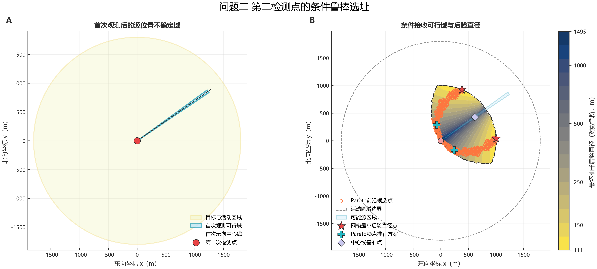
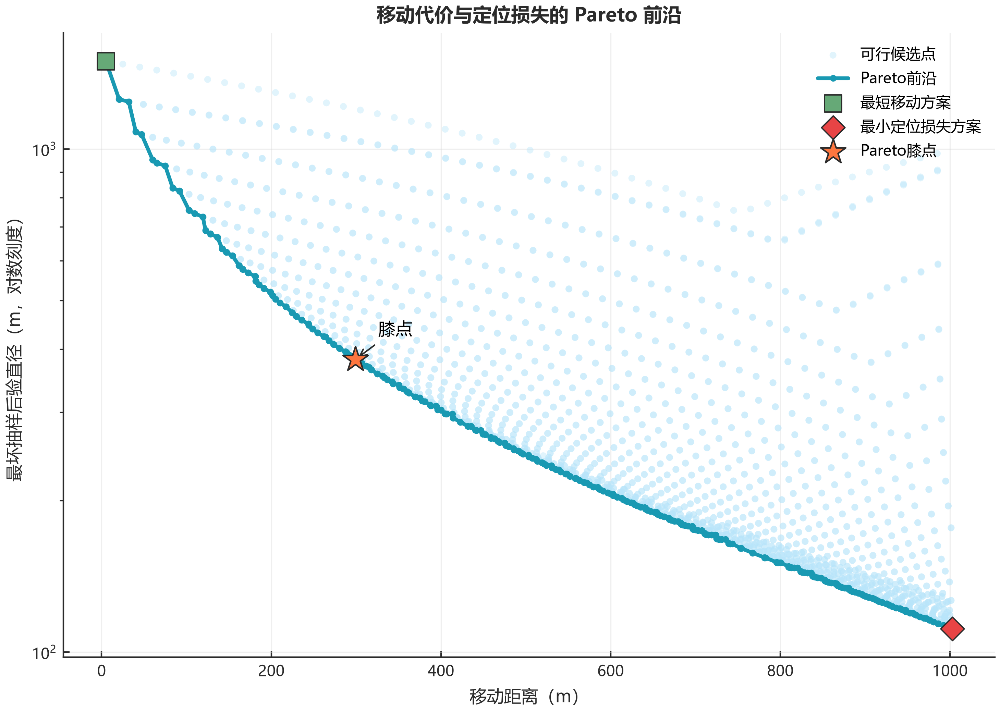
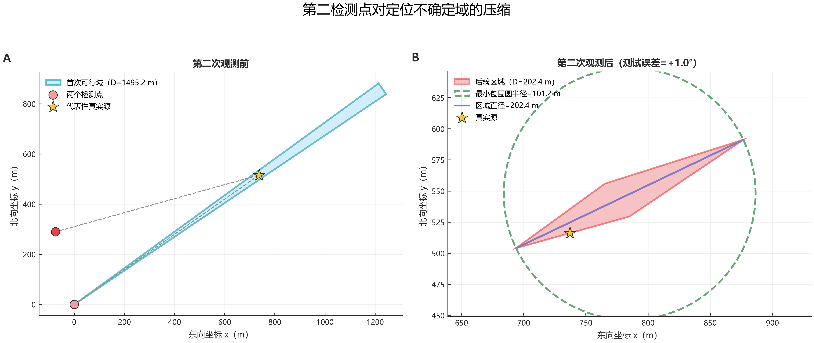
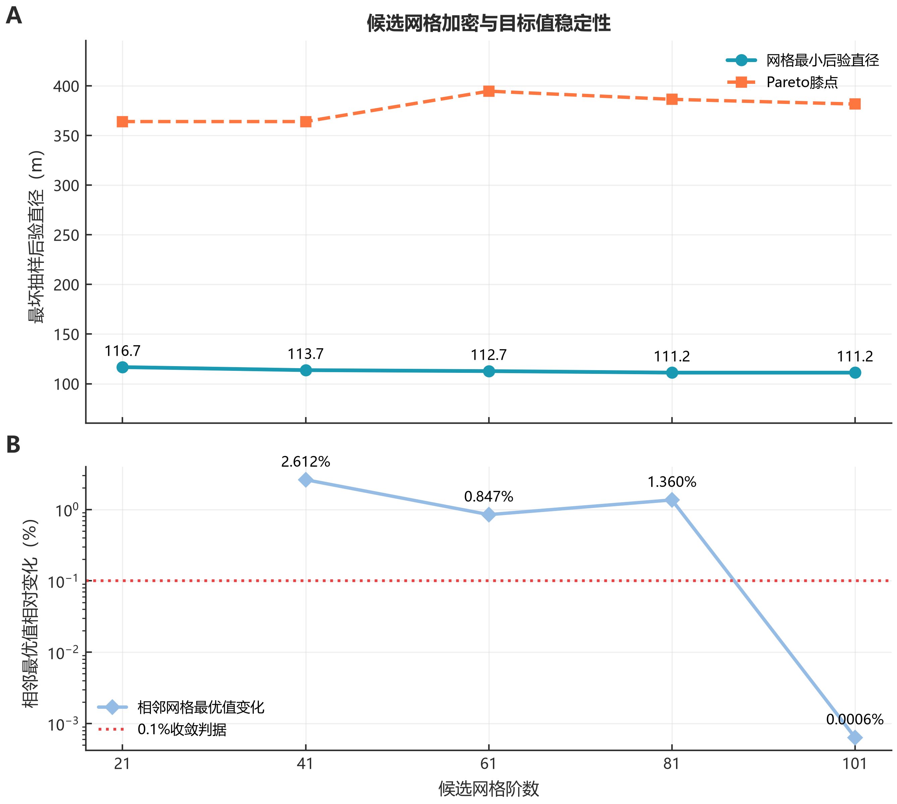
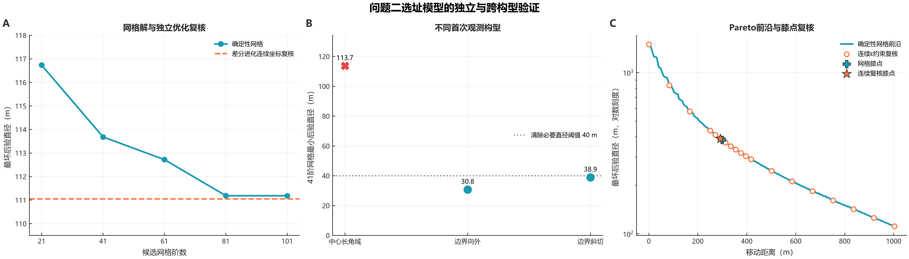

# 问题二 第二检测点的条件鲁棒选址

## 1 模型

第一次检测点为 $S_1$，示向度为 $\hat\theta_1$，测角误差不超过 $\varepsilon=1^\circ$。干扰源 $G$ 位于半径 1800 m 的目标圆域 $\Omega$ 内，有效接收半径 $R_G\in[1000,1500]$ m。第一次返回示向度而非强信号，因此

$$
K_1=\Omega\cap W(S_1,\hat\theta_1,\varepsilon)
\cap\{G:5<\|G-S_1\|\le1500\}
$$

为第一次检测后的源位置可行域，其中 $W$ 为半角 $1^\circ$ 的前向角域。

第一次成功接收说明

$$
R_G\ge \max\{1000,\|G-S_1\|\}.
$$

因此第二点 $S_2$ 对所有可能源均能获得有效返回，当且仅当

$$
\|G-S_2\|\le \max\{1000,\|G-S_1\|\},\qquad \forall G\in K_1.
$$

定义连续接收余量

$$
m_{\rm rec}(S_2)=\min_{G\in K_1}
\left[\max\{1000,\|G-S_1\|\}-\|G-S_2\|\right].
$$

数值计算保留 $m_{\rm rec}(S_2)\ge0.5$ m 的候选点。该最小值可由 $K_1$ 的顶点、边与半径 1000 m 圆的交点及圆弧极值点确定，不依赖随机抽样。

若第二次读数误差为 $e_2\in[-1^\circ,1^\circ]$，则后验区域为

$$
P_2(G,e_2;S_2)=K_1\cap
W\!\left(S_2,\operatorname{atan2}(G-S_2)+e_2,1^\circ\right).
$$

记 $D(P)$ 和 $R_*(P)$ 分别为区域直径和最小包围圆半径，定义候选点的最坏后验直径

$$
L(S_2)=\max_{G\in K_1,\ e_2\in[-1^\circ,1^\circ]}D[P_2(G,e_2;S_2)].
$$

第二检测点采用以下分层模型：

$$
\boxed{
\begin{aligned}
&S_2\in\mathcal F=\{S\in\Omega:m_{\rm rec}(S)\ge0.5\};\\
&\text{若存在 }\max_{G,e_2}R_*[P_2(G,e_2;S)]\le20\text{ m 的点，优先选路程最短者};\\
&\text{否则同时最小化 }\bigl(d(S),L(S)\bigr),\qquad
d(S)=\|S-S_1\|,\\
&\text{在所得 Pareto 前沿上用膝点准则确定推荐点}.
\end{aligned}}
$$

模型直接以定位区域大小评价第二次检测效果；交会角只作为几何诊断量。

设 Pareto 前沿上的最短移动距离、最长移动距离分别为 $d_{\min},d_{\max}$，最小和最大定位损失分别为 $L_{\min},L_{\max}$。由于前沿上的 $L$ 跨越一个数量级，采用对数尺度表达相对损失：

$$
x=\frac{d-d_{\min}}{d_{\max}-d_{\min}},\qquad
y=\frac{\ln L-\ln L_{\min}}{\ln L_{\max}-\ln L_{\min}}.
$$

归一化前沿的两个端点为 $(0,1)$ 和 $(1,0)$。取距离端点连线最远的点，即

$$
S_2^*=\arg\max_{S\in\mathcal P}\{1-x(S)-y(S)\},
$$

其中 $\mathcal P$ 为非支配候选点集合。该点之后若继续降低定位损失，需要付出明显更大的移动代价，因此作为两目标的折中方案；整个过程不再预设定位损失百分比。

## 2 求解算法

将目标圆和接收圆外逼近为正 180 边形，得到不遗漏真实源位置的凸多边形 $\widetilde K_1$。以首次示向方向和法向建立局部坐标，在完整条件接收域的包围盒内生成候选网格，并按实际活动范围筛选。

对每个候选点执行以下计算：

1. 连续审计接收余量，剔除 $m_{\rm rec}<0.5$ m 的点；
2. 在 $\widetilde K_1$ 的边界和内部布置确定性源样本，枚举第二次测角误差；
3. 对每个情景裁剪两个角域并计算后验直径；
4. 若 $D/2>20$ m，直接判定该情景不能保证清除，否则精确枚举两点圆和三点圆求最小包围圆；
5. 提取移动距离—最坏后验直径的 Pareto 前沿，并按膝点准则输出推荐点。

候选网格采用 21、41、61、81、101 阶逐级加密。各阶均取奇数，使首次示向中心线始终落在网格上；每次增加 20 阶，在计算量可控的条件下连续检查离散误差。当相邻两阶最优目标值的相对变化小于 0.1% 时停止，并用固定随机种子的差分进化在连续坐标上独立复核。

## 3 结果与候选区域

取 $S_1=(0,0)$、$\hat\theta_1=35^\circ$。首次可行域直径为 1495.229 m。101 阶网格得到

$$
L_h^*=111.187\ \mathrm m,
$$

对应两个对称网格点

$$
(382.402,927.085)\ \mathrm m,\qquad
(1001.964,42.258)\ \mathrm m.
$$

101 阶网格共有 508 个非支配候选点。Pareto 膝点及其关于首次示向线的对称点为

$$
\boxed{(-74.641,289.659)\ \mathrm m},\qquad
\boxed{(246.662,-169.209)\ \mathrm m}.
$$

令

$$
\boldsymbol e=(\cos\hat\theta_1,\sin\hat\theta_1),\qquad
\boldsymbol n=(-\sin\hat\theta_1,\cos\hat\theta_1),
$$

则推荐路线可写为

$$
\boxed{S_2=S_1+105.0\boldsymbol e\pm280.1\boldsymbol n.}
$$

推荐点移动距离为 299.122 m，最坏后验直径为 381.713 m，连续接收余量为 36.900 m。相比沿首次示向中心线布点的 747.616 m，后验直径缩小 48.94%。

| 指标 | 网格最小损失点 | Pareto膝点 |
|---|---:|---:|
| 移动距离/m | 1002.855 | 299.122 |
| 最小交会角/(°) | 31.735 | 11.317 |
| 条件接收余量/m | 1.307 | 36.900 |
| 最坏后验直径/m | 111.187 | 381.713 |



**图 1  首次观测可行域与第二检测点候选域。** 右图颜色表示最坏后验直径，橙色空心点为 Pareto 前沿候选点，星形和十字分别表示网格最小损失点和 Pareto 膝点。



**图 2  移动距离与定位损失的 Pareto 前沿。** 膝点由归一化对数损失前沿到两端点连线的最大距离确定，并与两个单目标极端方案对照。

代表性 900 m 中心射线源点的后验直径为 202.445 m，精确最小包围圆半径为 101.223 m，说明第二次检测压缩了定位区域，但该情景仍需继续补测。



**图 3  两次角域形成的后验区域。** 最小包围圆直接给出后续清除或补测的判据。

## 4 验证

网格阶数从 21 增至 101 时，最小后验直径依次为 116.732、113.683、112.721、111.188 和 111.187 m；81 阶到 101 阶的相对变化仅为 0.00064%，达到 0.1% 收敛判据。连续坐标差分进化在两个随机种子下得到 111.051 m 和 111.060 m，差异为 0.009 m。101 阶网格结果仅高 0.12%，两种算法均将最优区域定位在首次示向线两侧。

进一步以移动距离上限为约束，在连续极坐标中独立求解 19 个 $\varepsilon$-约束子问题。所得连续 Pareto 膝点为 $(-72.462,283.058)$ m，移动距离 292.186 m、最坏后验直径 388.768 m；它与网格膝点最近相距 6.952 m，移动距离和定位损失分别相差 2.32% 和 1.85%，且两随机种子复算的目标值仅相差 0.397 m，说明推荐点并非二维网格的偶然产物。

81 阶与 101 阶的膝点移动距离由 294.44 m 变为 299.12 m，最坏后验直径由 386.47 m 变为 381.71 m，变化分别为 1.59% 和 1.23%；推荐移动距离仅变化 4.68 m，小于 101 阶约 20 m 的网格步长。

固定101阶检测点网格后，继续同时加密源位置和测角误差：

| 源位置样本数 | 测角误差节点数 | 单点情景数 | 最优点后验直径/m | Pareto膝点后验直径/m |
|---:|---:|---:|---:|---:|
| 91 | 5 | 455 | 111.186847 | 381.712725 |
| 201 | 11 | 2211 | 111.186847 | 381.712725 |
| 601 | 21 | 12621 | 111.186847 | 381.712725 |

两点的最坏值在三层离散精度下均未变化，说明最坏情景已被低阶网格捕获；最终结论采用601个源样本和21个误差节点复核值。



**图 4  候选网格加密与目标值收敛。** 上图给出最小定位损失点与 Pareto 膝点的目标值，下图给出相邻网格最优值的相对变化；101 阶首次低于 0.1% 判据。

| 首次观测构型 | $K_1$直径/m | 41阶最小后验直径/m | 推荐点距$S_1$/m | 可保证20 m清除 |
|---|---:|---:|---:|:---:|
| 中心长角域 | 1495.229 | 113.683 | 317.760 | 否 |
| 边界向外 | 195.034 | 30.755 | 74.271 | 是 |
| 边界斜切 | 606.566 | 38.886 | 407.504 | 是 |

边界和斜切构型均重新搜索完整候选域，结果表明算法会随首次可行域形状自动调整布点，而不是机械套用中心对称坐标。



**图 5  独立优化与不同构型验证。** 左图复核最小定位损失，中图比较三种首次观测构型，右图比较网格与连续 $\varepsilon$-约束所得 Pareto 前沿及膝点。

## 5 结论

第二检测点应先满足条件接收保证；若不存在可直接保证 20 m 清除的点，则在移动距离与最坏定位损失的 Pareto 前沿上取膝点。实际任务中输入新的 $S_1$ 和 $\hat\theta_1$ 后重新计算 $K_1$、$\mathcal F$ 和 Pareto 前沿；获得第二次示向度后更新后验区域，并以最小包围圆半径决定清除或继续补测。

复现命令为：

```bash
python src/question2_demo.py
python src/question2_validation.py
python -m unittest discover -s tests -v
```
