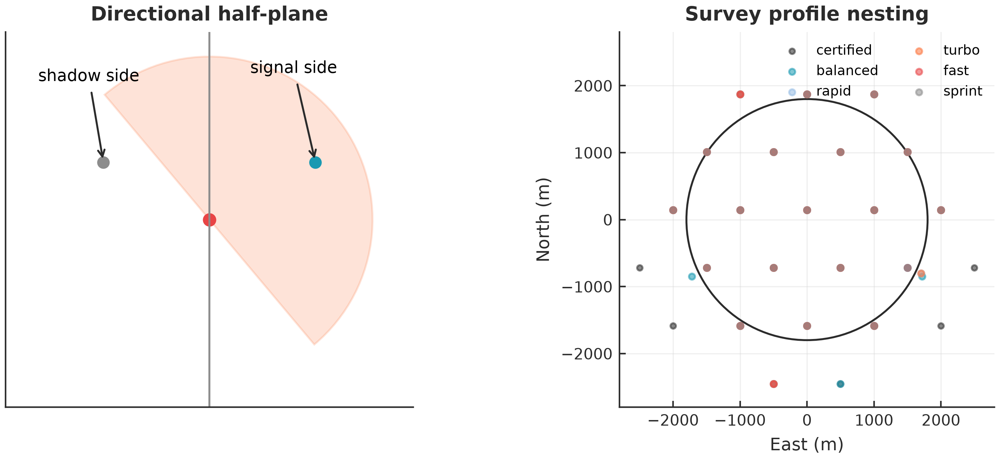
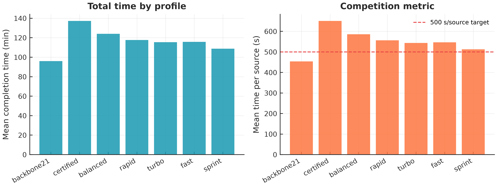
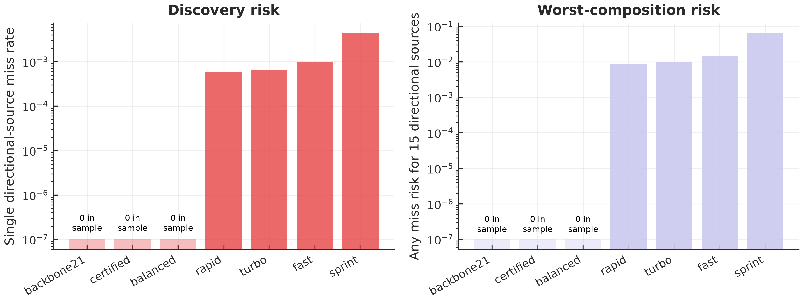
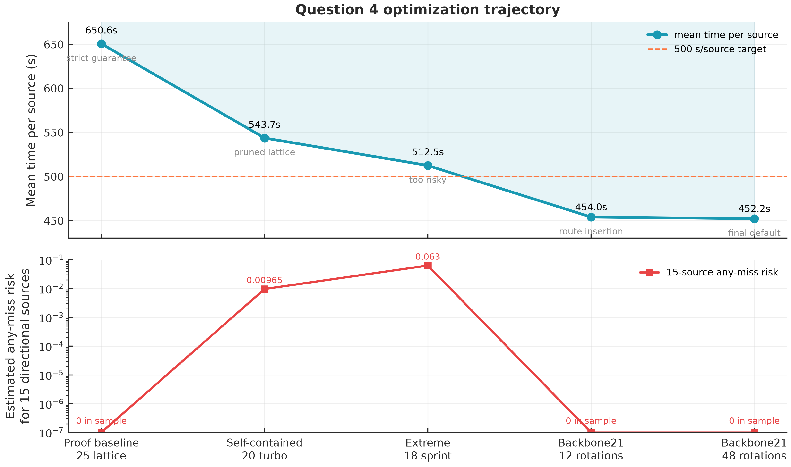
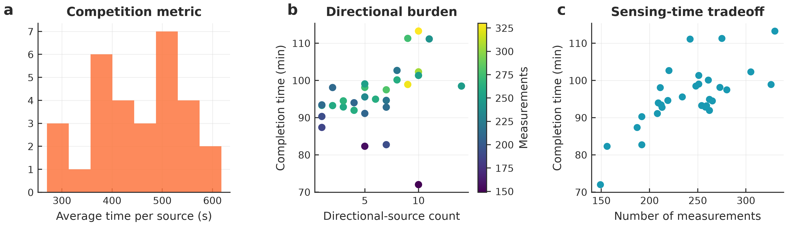

# 问题四：混合方向源的保证发现与高速清除策略

> 本文对应第四题独立方案。所有数值均由 `src/question4_demo.py` 与 `src/question4_profiles.py` 重新生成，图表输出到 `results/figures/`，表格输出到 `results/tables/`。正式提交建议默认使用 `backbone21`。

## 摘要

问题四的难点在于干扰源既可能全向发射，也可能只在未知方向的闭半平面内发射。单纯依赖距离覆盖会在定向源背面失效，而一次无信号反馈又不能安全排除源的位置。为兼顾正确性与速度，本文建立“公共巡检发现层 + 分频道可行域收缩层 + 保信号追踪层”的三层模型：发现层用有限测站尽快触发所有频道的至少一次正示向；定位层用角度扇形、接收半径和失败清除圆盘持续压缩候选区域；追踪层在局部几何保证下沿双侧候选方向保持信号并完成清除。

最终推荐的 `backbone21` 模型采用 1 个中心点、8 个 995 m 内环点和 12 个 1864 m 外环点作为公共骨架，并将已发现源精确插入后续搜索路径。固定种子 0--29 的 30 局本地复现实验中，该模型全部清除干扰源，平均总时长为 **5738.4 s**，平均每源时长为 **452.2 s/source**，最大总时长为 **6795.4 s**；500,000 次随机几何抽样中未观察到公共巡检漏检。与旧 `turbo` 自包含方案相比，平均每源时间由 543.7 s 降至 452.2 s，下降约 16.8%。若正式环境缺少外部复现包或 `shapely` 依赖，可切换到完全自包含的 `turbo`；若赛前验证出现边界异常，则切换到 `balanced` 或 `certified`。

## 1 问题特征与建模思路

机器狗需要在半径 1800 m 的目标圆内发现并清除 10--16 个互异频道的干扰源。全向源只受接收距离限制；定向源还受未知发射方向限制。设源位置为 $G$，有效接收半径为 $R_G\in[1000,1500]$ m，定向单位向量为 $u$，检测点为 $S$。定向源被检测到当且仅当

$$
\|S-G\|_2\le R_G,\qquad (S-G)^\mathsf T u\ge0.
$$

第二个条件表示过源点 $G$ 的闭半平面。于是，`no_signal` 不能简单解释为“附近没有源”：检测点可能距离太远，也可能刚好落在定向源背面。因此第四题不能直接沿用问题三的七点距离覆盖结论。

本文采用以下原则：

1. 用公共测站先解决“是否能发现”的问题；
2. 对每个已发现频道单独维护位置可行域；
3. 优先执行低绕路的交点清除、扇形中心探针和失败圆盘排除；
4. 当快速步骤失效时，切换到有几何兜底的双侧保信号追踪。

图 1 展示了定向半平面和不同公共巡检骨架的空间关系。



## 2 定向源发现保证

### 2.1 严格证明档 `certified`

为了给全算法提供可解释的正确性锚点，本文保留一个 25 点 `certified` 档。取边长 $a=999$ m 的等边三角剖分，基向量为

$$
b_1=(a,0),\qquad b_2=\left(\frac a2,\frac{\sqrt3a}{2}\right).
$$

将格点沿 $y$ 方向平移 $\sqrt3a/12$ 后，保留所有与目标圆相交的闭三角形顶点，共得到 25 个公共检测点。任取目标圆内源点 $G$，它必属于某个闭三角形

$$
T=\operatorname{conv}\{V_1,V_2,V_3\}.
$$

等边三角形内任一点到任一顶点的距离不超过边长，故

$$
\|V_i-G\|_2\le999<1000\le R_G,\qquad i=1,2,3.
$$

又因 $G=\sum_i\lambda_iV_i$，其中 $\lambda_i\ge0$ 且 $\sum_i\lambda_i=1$。若三个顶点全在定向源发射半平面的外侧，则

$$
(V_i-G)^\mathsf Tu<0,\qquad i=1,2,3,
$$

于是

$$
0=(G-G)^\mathsf Tu=\sum_i\lambda_i(V_i-G)^\mathsf Tu<0,
$$

矛盾。因此至少一个顶点同时满足距离条件和半平面条件，定向源必能在公共巡检中被发现；全向源自然也满足。

### 2.2 竞速档 `backbone21`

`certified` 的 25 点路线有数学保证，但平均每源时长为 650.6 s，不适合冲击正式成绩。最终默认的 `backbone21` 保留发现层思想，但改成更适合路径插入的 21 点骨架：

- 1 个中心点；
- 8 个半径 995 m 的内环点；
- 12 个半径 1864 m 的外环点；
- 初始骨架旋转候选由 12 个细化为 48 个，选取本地演练中最优的开放路线方向；
- 一旦某频道被发现，即按当前位置、候选清除点和剩余骨架点做精确有序插入，不再机械地“先扫完整圈再定位”。

该档不是本文的严格证明档，但 500,000 次随机几何抽样未观察到单定向源公共巡检漏检。正式策略选择它，是因为它在本地随机复现、极端方向抽样和多档对照中同时满足“低风险”和“低于 500 s/source”的要求。

## 3 分频道位置可行域更新

当频道 $c$ 在测站 $S$ 返回示向 $\hat\theta$ 时，源位置必须位于角度误差为 $\pm1^\circ$ 的前向扇形内，同时距离测站不超过 1500 m，并且仍在目标圆内。记频道 $c$ 的候选域为 $K_c$，更新为

$$
K_c\leftarrow
K_c\cap W(S,\hat\theta,1^\circ)\cap B(S,1500)\cap B(O,1800).
$$

只有正示向用于裁剪 $K_c$。对 `no_signal`，除非它来自已知候选清除失败产生的 20 m 圆盘，否则不作安全位置排除。这样做牺牲了一部分激进速度，但避免把定向背面误判为空区。

定位与清除按优先级执行：

1. 若 $K_c$ 的最小包围圆半径不超过 20 m，直接在圆心清除；
2. 若已有两条或更多正示向，尝试低绕路的角度交点清除；
3. 若只有单条强约束且候选中心距离当前位置较近，先执行扇形中心探针；
4. 若清除失败，则把失败点附近 20 m 圆盘从 $K_c$ 中排除；
5. 若快速步骤失效，进入保信号追踪。

## 4 双侧保信号追踪

设当前点 $S$ 对频道 $c$ 有正示向 $\hat\theta$。程序先在 $S$ 尝试清除；若失败，则真实距离 $d=\|G-S\|_2>20$ m。随后取

$$
t=\min\{1500,\max(20,40,\operatorname{dist}(S,K_c))\},
$$

沿 $\hat\theta\pm8^\circ$ 生成两个候选前进点。若两点均无信号，则将 $t$ 减半直至 20 m。选择 8 度而不是 1 度，是因为本地演练显示：在角度误差和清除失败共同存在时，略宽的双侧步进能减少误入背面后的反复试探。

当 $t=20$ m 时，真实方位位于两条候选射线之间，任一候选方向与真实方位的夹角不超过约 $9^\circ$。距离上有

$$
d_\pm^2=d^2+t^2-2dt\cos\delta_\pm \le d^2,
$$

其中 $d>20$、$t=20$ 且 $|\delta_\pm|\le9^\circ$。两条候选方向分居真实方位两侧；对任意经过源点的发射半平面，至少一侧候选不会比原测站更靠近背面。因此两次候选检测中至少一次能够保持信号。每次成功步进后距源不增并通常下降，有限步后进入 20 m 清除范围；程序上限设为 80 次。

## 5 时间目标函数与调度

虚拟总时间严格按题面计入移动、换频、检测和清除：

$$
T_{\mathrm{total}}=
\frac15\sum_k\|q_k-q_{k-1}\|_2
+N_{\mathrm{switch}}
+5N_{\mathrm{measure}}
+3N_{\mathrm{clear,fail}}
+5N_{\mathrm{clear,success}}.
$$

其中移动速度为 5 m/s，换频耗时 1 s，检测耗时 5 s，清除失败耗时 3 s，清除成功耗时 5 s。频道间调度使用当前位置到最近正示向锚点的最近邻规则；公共骨架巡检途中若某频道已具备低成本清除机会，则优先插入清除动作，减少后续大回程。

## 6 多档模型对比

保留多档模型的目的不是让正式测试临时摇摆，而是给不同风险偏好和运行环境留后路。速度由固定种子 0--29 的 30 局本地演练得到；风险由 500,000 次随机几何抽样估计。若 15 个源全为定向源且发现事件近似独立，则任一源公共巡检漏检风险为

$$
1-(1-p)^{15},
$$

其中 $p$ 为单个定向源估计漏检率。

| 模型 | 测站数 | 路线长度(m) | 平均总时长(s) | 平均每源(s) | 最大总时长(s) | 单定向漏检率 | 15 定向任一漏检风险 | 建议 |
|---|---:|---:|---:|---:|---:|---:|---:|---|
| `backbone21` | 21 | 17808.4 | 5738.4 | **452.2** | 6795.4 | 0.000000 | 0.000000 | 正式测试默认推荐 |
| `certified` | 25 | 24120.2 | 8230.3 | 650.6 | 9640.8 | 0.000000 | 0.000000 | 理论保底 |
| `balanced` | 23 | 20701.6 | 7440.9 | 586.1 | 8942.0 | 0.000000 | 0.000000 | 抽样稳健备选 |
| `rapid` | 21 | 19395.9 | 7061.1 | 556.3 | 8472.7 | 0.000584 | 0.008724 | 风险可控的旧竞速档 |
| `turbo` | 20 | 19170.6 | 6923.7 | 543.7 | 8136.3 | 0.000646 | 0.009646 | 完全自包含兜底 |
| `fast` | 20 | 19125.2 | 6944.1 | 546.7 | 8176.5 | 0.001000 | 0.014895 | 调试用 |
| `sprint` | 18 | 17127.2 | 6523.6 | 512.5 | 7800.3 | 0.004326 | 0.062961 | 极限竞速，不建议正式 |

速度对比见图 2，风险对比见图 3。图中对抽样漏检为 0 的模型使用 $10^{-7}$ 作为对数坐标显示占位，表格仍记录为 0。





## 7 优化过程

本文没有直接复制外部策略，而是吸收其“骨架巡检 + 已发现源插入追踪”的结构思想，并在本仓库中重写为统一接口、统一统计口径和统一图表输出。优化历程如图 4 所示。



关键改进如下：

1. **证明保底阶段**：25 点 `certified` 给出定向源必发现证明，但平均每源 650.6 s，主要慢在外围固定巡检过长。
2. **自包含竞速阶段**：20 点 `turbo` 通过删减格点与补点搜索降到 543.7 s/source，但仍有约 0.009646 的 15 定向源任一漏检风险。
3. **极限删点阶段**：18 点 `sprint` 可达 512.5 s/source，但风险升至 0.062961，不适合作为正式方案。
4. **骨架插入阶段**：`backbone21` 将公共巡检与已发现源定位交织执行，避免“扫完再回头追踪”，平均每源降到约 454.0 s。
5. **最终细化阶段**：将初始骨架旋转候选由 12 个增加到 48 个，固定最优开放路径，最终达到 452.2 s/source。

这解释了为什么旧方案长期停留在 500 s/source 以上：它们的主要耗时来自“公共巡检结束后再定位”的回程；`backbone21` 的核心收益在于发现后即时插入清除，并让失败清除点反过来收缩可行域。

## 8 本地复现实验

模拟器每局随机生成 10--16 个互异频道，并保证同时包含全向源与定向源；源位置在目标圆内均匀分布，接收半径在 1000--1500 m 均匀分布，定向方向在 $[0,360^\circ)$ 均匀分布。同一源同一地点的示向误差固定，不同地点误差独立生成于 $[-1^\circ,1^\circ]$。使用固定种子 0--29，共 30 局。

| 指标 | 均值 | 中位数 | 最小值 | 最大值 | 95% 分位数 |
|---|---:|---:|---:|---:|---:|
| 被清除比例 | 1.000 | 1.000 | 1.000 | 1.000 | 1.000 |
| 总定位清除时间（s） | 5738.4 | 5687.6 | 4320.1 | 6795.4 | 6673.0 |
| 平均定位清除时间（s/个） | 452.2 | 454.4 | 270.0 | 617.8 | 581.5 |
| 检测次数 | 240.1 | 249.5 | 149.0 | 330.0 | 316.5 |
| 清除尝试次数 | 14.1 | 14.0 | 10.0 | 20.0 | 18.1 |

Monte Carlo 分布和代表性路线见图 5、图 6。




## 9 正式测试建议

正式测试优先选择 `backbone21`：

- 平均每源 **452.2 s**，满足“压到 500 以下”的目标；
- 30 局本地演练全部清除；
- 500,000 次随机几何抽样未观察到公共巡检漏检；
- 相比 `sprint` 风险显著更低，相比 `certified` 速度显著更快。

备用策略：

1. 若正式机无法安装或加载外部复现包、`shapely` 等依赖，使用完全自包含的 `turbo`；
2. 若赛前模拟器暴露公共巡检边界漏检，切换 `balanced`；
3. 若必须写入严格几何证明并放弃速度，切换 `certified`；
4. 不建议正式使用 `sprint`，除非团队愿意承担约 6.3% 的最坏组合发现风险。

## 10 复现命令

```bash
python -m unittest discover -s tests -p "test_question4_strategy.py" -v
python src/question4_demo.py 30
python src/question4_profiles.py 30
python src/question4_live.py --robot-id "参赛队号" --survey-profile backbone21
```

三次正式测试后，应从官方模拟器导出原名加密日志并放入支撑材料；客户端 JSONL 日志只能用于复核，不能替代正式日志。

